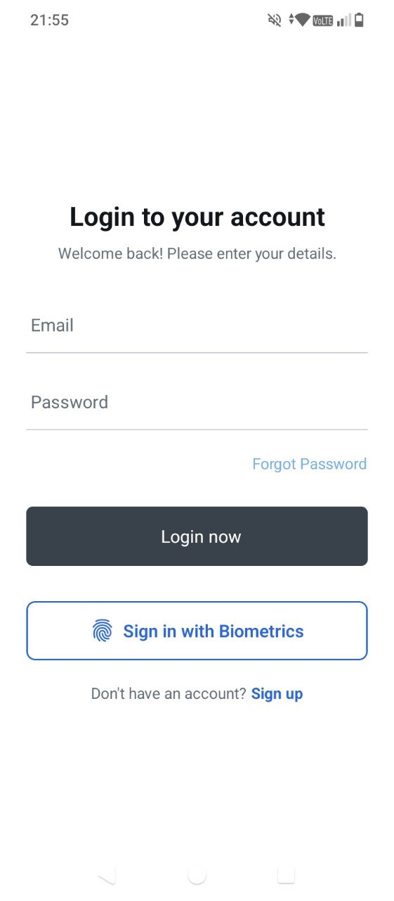
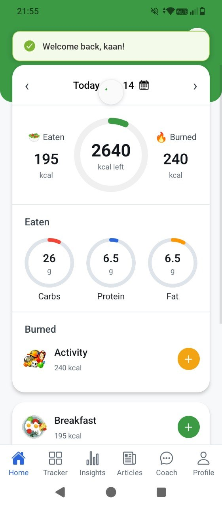
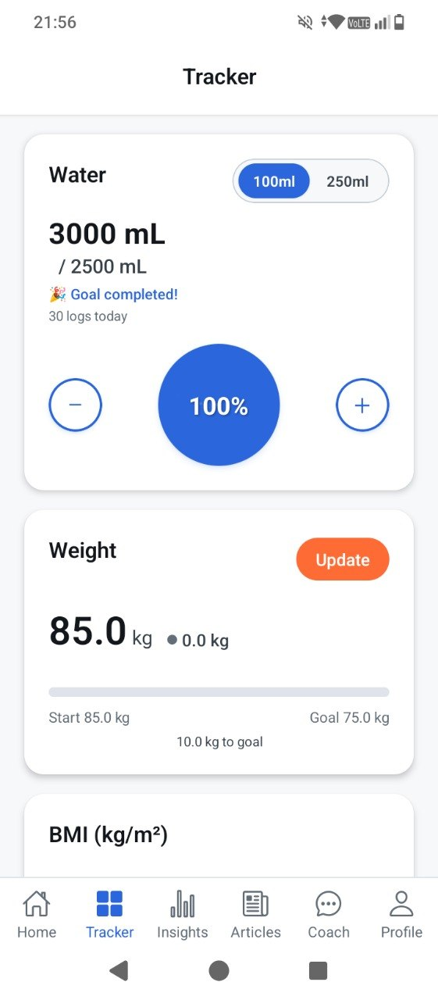
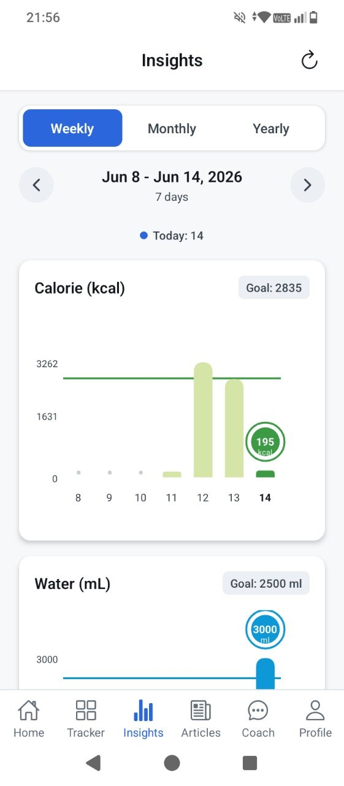
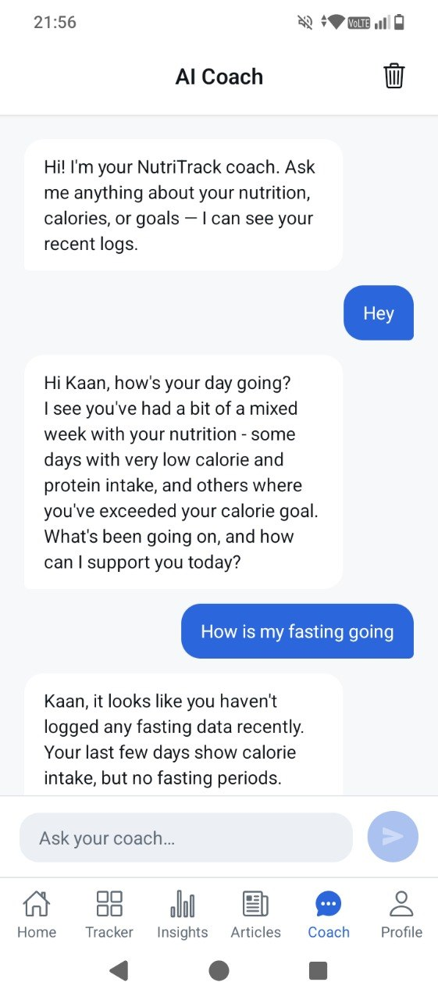
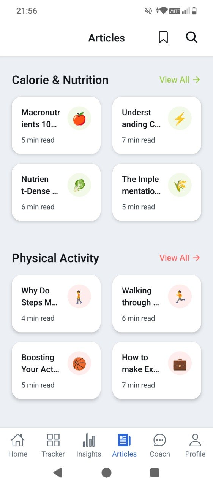
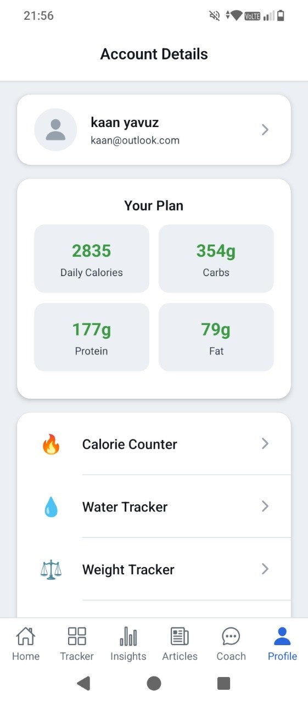

# NutriTrack

[](LICENSE)
[](https://expo.dev)
[](https://reactnative.dev)
[](https://nodejs.org)
[](https://www.postgresql.org)

A full-stack mobile nutrition & fitness tracker. **React Native (Expo)** frontend, **Node.js + Express + PostgreSQL** backend, **Groq AI** for food-photo recognition and a nutrition coach.

| Login | Home | Tracker |
|:---:|:---:|:---:|
|  |  |  |
| **Insights** | **AI Coach** | **Articles** |
|  |  |  |
| **Account** | | |
|  | | |

---

## Table of Contents
- [Features](#features)
- [Tech Stack](#tech-stack)
- [Architecture](#architecture)
- [Screens & Navigation](#screens--navigation)
- [Getting Started](#getting-started)
- [Running on a Device](#running-on-a-device)
- [Environment Variables](#environment-variables)
- [Project Structure](#project-structure)
- [Design System](#design-system)
- [Backend API](#backend-api)
- [Security](#security)
- [Testing](#testing)
- [Known Limitations](#known-limitations)
- [Roadmap](#roadmap)
- [License](#license)

---

## Features

### Tracking
- **Food logging** — Meals (breakfast/lunch/dinner/snack) with full macro breakdown. USDA food search, **barcode scanner** (OpenFoodFacts lookup), **AI photo recognition**, custom foods, favorites, recent-foods history, and reusable **saved meals**.
- **Activity logging** — 55-activity built-in library (sports, cardio, strength, combat, outdoor), custom activities, favorites, duration-based calorie calculation.
- **Water intake** — Animated gauge, per-log add/remove with haptics, daily goal, celebration on completion, **local reminders** with custom sounds.
- **Weight tracking** — History with automatic BMI, goal-progress bar, profile sync, and **progress photos** (local gallery + side-by-side compare).

### Intelligence
- **Insights dashboard** — Weekly / monthly (4 weeks) / yearly (12 months) charts for calories, water, and weight. Swipe-friendly, tap a column to inspect.
- **AI Photo** — Snap a plate → Groq vision model estimates calories & macros → prefills the food form.
- **AI Coach** — Chat tab; the coach sees your last 7 days of data, weight, and profile and answers nutrition questions (conversation stored on-device).
- **Personalised plan** — 10-step onboarding computes calorie/macro targets via Mifflin-St Jeor; recalculated when weight changes.
- **Calorie-overflow ring** — Home ring shows excess intake in a darker shade once the goal is passed.

### Platform & UX
- **Swipeable bottom tabs** — Home · Tracker · Insights · Articles · Coach · Profile. Swipe horizontally between them (Instagram-style) with smooth color crossfade on the bar.
- **Biometric login** — Face/fingerprint unlock when enabled.
- **Profile photo** — Take/pick a photo (stored locally).
- **Haptics** — Tactile feedback on key actions and every toast.
- **Local notifications** — Water reminders with 5 bundled ringtones, vibration, and "stop at goal".
- **Design system** — Central tokens + shared `ScreenHeader`, `BottomNavigation`/`MainTabs`, `OptionPicker`, `AppToast`.
- **Articles** — Knowledge base with categories, search, bookmarking, and native share sheet.
- **JWT auth** — Signup, login, 30-day sessions, bcrypt (cost 12), rate-limited endpoints.

---

## Tech Stack

| Layer | Technology |
|---|---|
| Mobile app | React Native 0.85, Expo SDK 56 (New Architecture / Fabric) |
| Navigation | React Navigation 7 — native stack + **material-top-tabs** (swipeable) |
| Animation / keyboard | react-native-reanimated 4 (`useAnimatedKeyboard`) |
| Charts & graphics | react-native-svg, Shopify Skia, D3 |
| State | React Context API (8 providers) |
| Storage | AsyncStorage (data/cache, photos metadata), SecureStore (JWT), expo-file-system (photo files) |
| Device | expo-camera, expo-image-picker, expo-haptics, expo-local-authentication, expo-notifications |
| Backend | Node.js 20, Express 4, helmet, express-rate-limit |
| Database | PostgreSQL 16 |
| Auth | JWT (jsonwebtoken) + bcryptjs |
| External data | USDA FoodData Central, OpenFoodFacts, **Groq** (Llama 4 Scout vision + Llama 3.3 70B chat) |

---

## Architecture

```
┌───────────────────────────────────────────────┐
│        React Native / Expo App                │
│  Screens → Contexts → NutritionService /      │
│                       AuthService             │
│            │ HTTP (LAN IP or localhost:3001)  │
└───────────────────────────────────────────────┘
                    │
┌───────────────────▼───────────────────────────┐
│        Express API  (backend/)                │
│  /api/auth /api/nutrition /api/tracker        │
│  /api/food /api/activity  /api/insights       │
│  /api/user /api/settings  /api/articles       │
│  /api/ai (Groq proxy — key server-side only)  │
└───────────────────────────────────────────────┘
                    │
┌───────────────────▼───────────────────────────┐
│        PostgreSQL 16                          │
│  users · food_entries · activity_logs         │
│  water_logs · weight_logs · user_daily_data   │
│  user_daily_targets · user_settings           │
│  favorite/custom_foods · saved_meals · …      │
└───────────────────────────────────────────────┘
```

**Data-flow conventions**
- Screens never `fetch` nutrition data directly — they go through a Context → the `NutritionService` singleton (`request(path, options)` with JWT).
- PostgreSQL `NUMERIC` columns come back as **strings** from `pg`. Always `parseFloat()` + round before rendering.
- Backend code is **baked into the Docker image** — after backend changes run `docker-compose up -d --build backend`. Frontend changes only need a Metro reload.
- AI requests always go through `/api/ai` so the Groq key never reaches the client.

---

## Screens & Navigation

The 6 primary tabs live in a swipeable **material-top-tabs** navigator (`src/navigation/MainTabs.js`) with a custom bottom bar:

```
Home → Tracker → Insights → Articles → Coach → Profile
```

Everything else (food/activity detail, settings sub-pages, barcode scanner, progress photos, onboarding, auth) are stack screens pushed on top with a slide-from-right animation. All headers use the shared `ScreenHeader` for consistent top spacing and safe-area handling.

---

## Getting Started

### Prerequisites
- [Node.js 20+](https://nodejs.org)
- [Docker + Docker Compose](https://docs.docker.com/compose/) **or** local PostgreSQL 16
- Android emulator (Android Studio) or a physical device with Expo Go (SDK 56)

### Quick start (Docker — recommended)
```bash
git clone https://github.com/your-username/NutriTrack.git
cd NutriTrack
cp .env.example .env          # set POSTGRES_PASSWORD, JWT_SECRET, GROQ_API_KEY

docker-compose up --build     # PostgreSQL + Express API on :3001
npm install
npx expo start                # press "a" for Android emulator
```
Schema (`backend/schema.sql`) auto-applies on first DB start.
Health check: <http://localhost:3001/api/health>

### Local backend (no Docker)
```bash
cd backend && npm install
psql -U postgres -c "CREATE DATABASE nutritrack;"
psql -U postgres -d nutritrack -f schema.sql
npm run dev
```

---

## Running on a Device

### Android emulator
`npx expo start`, then press **a**. Expo CLI installs the matching Expo Go automatically.

### Physical phone (Expo Go)
1. Set `EXPO_PUBLIC_API_URL=http://<YOUR_PC_LAN_IP>:3001/api` in `.env` (find the IP with `ipconfig`).
2. Run `npx expo start` and scan the QR code with Expo Go.
3. Keep the phone and PC on the same Wi-Fi, with the backend running.

---

## Environment Variables

`.env` at the project root (read by both Docker and Expo):

| Variable | Used by | Purpose |
|---|---|---|
| `POSTGRES_PASSWORD` | db | Postgres password |
| `DATABASE_URL` | backend | Connection string |
| `JWT_SECRET` | backend | Token signing (server refuses to start without it) |
| `PORT` | backend | API port (default 3001) |
| `GROQ_API_KEY` | backend | Groq AI (food-photo + coach). Blank → AI returns 503 |
| `CORS_ORIGIN` | backend | Allowed origin in production |
| `SMTP_*` | backend | Forgot-password email (optional; blank logs token) |
| `EXPO_PUBLIC_API_URL` | **app** | Client API base URL (`EXPO_PUBLIC_` is bundled into the app) |

---

## Project Structure

```
NutriTrack/
├── App.js                     # Root — 8 context providers + ToastHost
├── app.json                   # Expo config (plugins: splash, secure-store, notifications)
├── docker-compose.yml         # db + backend
├── .env.example
├── assets/
│   ├── fonts/                 # Roboto family
│   └── sounds/                # 5 notification ringtones (WAV)
├── src/
│   ├── theme.js               # Design tokens (COLORS/SPACING/RADIUS/SHADOWS/TYPOGRAPHY)
│   ├── config.js              # API base URL resolution
│   ├── navigation/
│   │   ├── AppNavigator.js     # Native stack (auth, detail, settings screens)
│   │   └── MainTabs.js         # Swipeable 6-tab navigator + custom bottom bar
│   ├── components/
│   │   ├── ScreenHeader.js     # Unified safe-area header (centered title)
│   │   ├── BottomNavigation.js # Bottom bar for detail screens (→ MainTabs)
│   │   ├── OptionPicker.js     # Centered selection modal
│   │   ├── AppToast.js         # showToast(msg, type) + haptics
│   │   └── CaloriesProgressCircle.js
│   ├── context/               # Auth · SignUp · Meals · Activity · Water · Weight · Insights · Bookmark
│   ├── services/
│   │   ├── AuthService.js
│   │   ├── NutritionService.js     # all food/activity/AI API calls (singleton)
│   │   ├── NotificationService.js  # reminders, ringtones, channels (lazy-loaded)
│   │   ├── PhotoStorage.js         # local profile + progress photos
│   │   └── UsdaFoodApiService.js
│   ├── utils/haptics.js
│   ├── screens/               # onboarding · auth · main (home/tracker/insights/coach)
│   │                          # · food · activity · articles · settings
│   └── data/                  # sampleActivities (55), articles, notifications
└── backend/
    ├── Dockerfile
    ├── schema.sql             # Full schema (incl. saved_meals, bmi/weight columns)
    └── src/
        ├── index.js           # Express entry: helmet, CORS, rate limits, routes
        ├── db.js              # pg pool + transaction helpers
        ├── middleware/auth.js # JWT validation (no fallback secret)
        └── routes/            # auth · nutrition · food · activity · activityLogs
                                # · tracker · insights · user · settings · articles · ai
```

---

## Design System

Two-layer tokens in [`src/theme.js`](src/theme.js): **core** primitive ramps → **semantic** tokens the screens use. Every text/background pairing meets **WCAG AA** (computed, not eyeballed).

| Token group | Values |
|---|---|
| Brand / action | primary `#2C66DC` (white-text AA 5.2) · primaryDark `#1E51BE` · primarySoft `#ECF2FE` |
| Semantic | success `#3C9A45` · warning `#F2A413` (always dark text) · danger `#D63A2D` · info = primary |
| Domain accents | water `#0E98D8` (cyan, distinct from action) · weight `#F2511E` · activity = warning · food = success |
| Data-viz | `CHART.carbs` `#F54336` · `CHART.fat` `#FF9800` (pinned macro palette, brand-independent) |
| Neutrals | 11-step gray ramp → text / border / surface / shadow |
| Spacing / Radius | 4–24 · sm 8 / md 12 / lg 16 / pill · `TOUCH_TARGET` 48 |
| Typography | h1 / h2 / headerTitle / sectionTitle / body / button / caption |
| Brand exception | `brandGoogle #4285F4` — isolated, explicitly *not* part of the palette |

Shared primitives: `Button` (variants + loading/disabled + press-scale + a11y), `Card`, `ListRow`, `SectionHeader`, `EmptyState`, `ErrorState`, `OfflineBanner`, `Skeleton`, `ScreenHeader`, `OptionPicker`.

Enforced conventions:
- All color / spacing / radius via `theme.js` tokens — **no hardcoded hex** in screens.
- Page headers use `ScreenHeader`; success feedback via `showToast(...)`, never blocking `Alert`.
- Selection via centered `OptionPicker`; bottom buttons respect `useSafeAreaInsets().bottom`.
- `console.log` banned in `src/`; ESLint (flat config) gates real errors on every PR.
- **Motion** — reanimated worklets, 150–300 ms, interruptible, **all honoring OS "reduce motion"** (`useReducedMotion`).
- **Accessibility** — roles + labels on interactive elements, text alternatives for the ring/charts, 44 pt+ targets, font scaling never disabled.

---

## Backend API

| Group | Endpoints (selected) |
|---|---|
| `/api/auth` | `POST /signup`, `POST /login`, `GET /profile`, `POST /forgot-password` |
| `/api/nutrition` | `GET /daily/:date`, `POST /food`, `DELETE /food/:id`, `POST /activity` |
| `/api/food` | `GET/POST /favorites`, `/custom`, `/recent`, **`GET/POST/DELETE /meals`** (saved meals) |
| `/api/activity` | `/favorites`, `/custom`, `/recent`, `/search`, `/stats` |
| `/api/tracker` | `POST/DELETE /water`, `GET /water/daily/:date`, `POST/PUT/DELETE /weight` |
| `/api/insights` | `GET /dashboard?period=weekly|monthly|yearly` (server-side aggregation) |
| `/api/user` | `GET/PUT /profile`, `GET/PUT /daily-targets` |
| `/api/settings` | `GET /`, `PUT /calorie`, `PUT /water` |
| `/api/ai` | `POST /food-photo` (vision), `POST /coach` (chat) — Groq proxy, rate-limited 10/min |

Every protected route uses the `authenticateToken` middleware and parameterized SQL.

---

- Passwords hashed with bcrypt (cost 12); **plaintext password is never written to disk** on the client.
- JWT secret comes only from the environment — server refuses to start without it; **no insecure fallback**.
- All SQL is parameterized (no injection); queries are **owner-scoped** (no IDOR/BOLA).
- Rate limiting: 10 logins / 15 min, 5 signups / hour, 10 AI calls / min, 200 req/min general.
- helmet headers; CORS open in dev, locked via `CORS_ORIGIN` in production.
- Groq API key stays server-side; never bundled into the app; not present in git history.
- Request logging excludes bodies; error responses return **generic messages** (no stack/detail leak).
- **OWASP pass** — verified clean on exposed secrets, SQL injection, broken auth, and IDOR. Fixed an `insights` error-detail leak and removed a debug endpoint that dumped user data. `npm audit`: **0 on the backend** (11 moderate transitive in the Expo build chain, none runtime-exploitable). The supertest suite asserts 401/400/429 as regression tests.

---

**63 automated tests, green.**
- **Backend** — Jest + supertest, **18 tests** against the dockerized Postgres: auth-required (401), validation (400), rate-limit (429), and the full new-user journey (signup → login → protected routes). Run: `cd backend && npm test`.
- **Frontend** — Jest (`jest-expo`) + React Native Testing Library, **45 tests**: calorie/macro/BMI math (incl. a parity test proving the extracted util matches the old inline calc), formatters, validation helpers, context state, and the shared primitives. Run: `npm test`.
- **Lint** — ESLint flat config (no TypeScript dep) over `src` + `backend/src`: `npm run lint` (errors fail; style noise warns).
- **CI** — [`.github/workflows/ci.yml`](.github/workflows/ci.yml) runs **lint + both suites** (backend with a Postgres service container) on every PR and push to `main`.

---

## Known Limitations
- **Auth tokens** — 30-day JWT with **no refresh/rotation** yet; logout clears client state only (see Roadmap).
- **Notifications** — Custom ringtones and reliable Android notifications require a development build; Expo Go falls back to the system sound.
- **Photos** — Profile and progress photos are stored **locally** (lost on reinstall / not synced across devices).
- **Home-only backend** — On a physical phone the backend lives on your PC, reachable only on the same Wi-Fi. For anywhere-access, deploy the backend to the cloud.
- **AI** — Requires a `GROQ_API_KEY`; without it the AI endpoints return 503 and the UI shows a friendly message.
- **Chart tints** — Secondary/series chart colors aren't yet tokenized into a `CHART.*` set (brand + macro colors are).
- **Accessibility (device-only)** — Remaining checks need a real device: dynamic-type layout at 200 %+ and a full screen-reader focus-order pass. Per-input explicit labels are a polish follow-up (inputs already announce via placeholder/value).
- **List animations** — Add/remove **exit** animations on `FlatList`s are intentionally omitted (Fabric unmounts rows instantly → would flicker); a flickering list is worse than none.

---

- [x] Automated tests (Jest + supertest + RNTL) and CI
- [x] Design-system token SSOT (WCAG AA), motion + accessibility pass, OWASP hardening
- [ ] **Refresh-token rotation + revocation** (currently a 30-day JWT)
- [ ] **`CHART.*` secondary/series token set** for chart tints
- [ ] Deploy backend to the cloud (Render/Railway) for off-Wi-Fi use
- [ ] EAS Build / OTA updates
- [ ] Apple Sign-In & Google OAuth (deps installed)
- [ ] Dark mode (two-layer tokens make it straightforward)
- [ ] Micronutrient tracking, recipe builder, pedometer (`expo-sensors`)
- [ ] i18n (TR/EN)

---

## License
MIT — see [LICENSE](LICENSE). Copyright (c) 2025 Kaan
